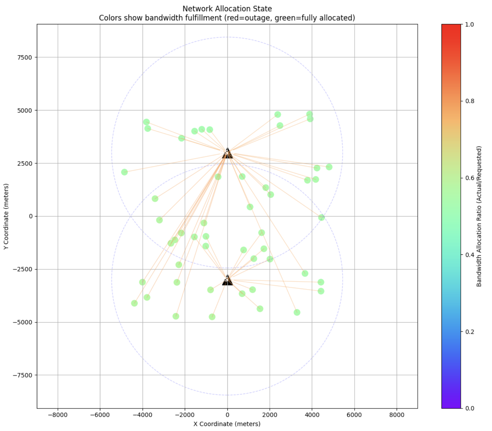
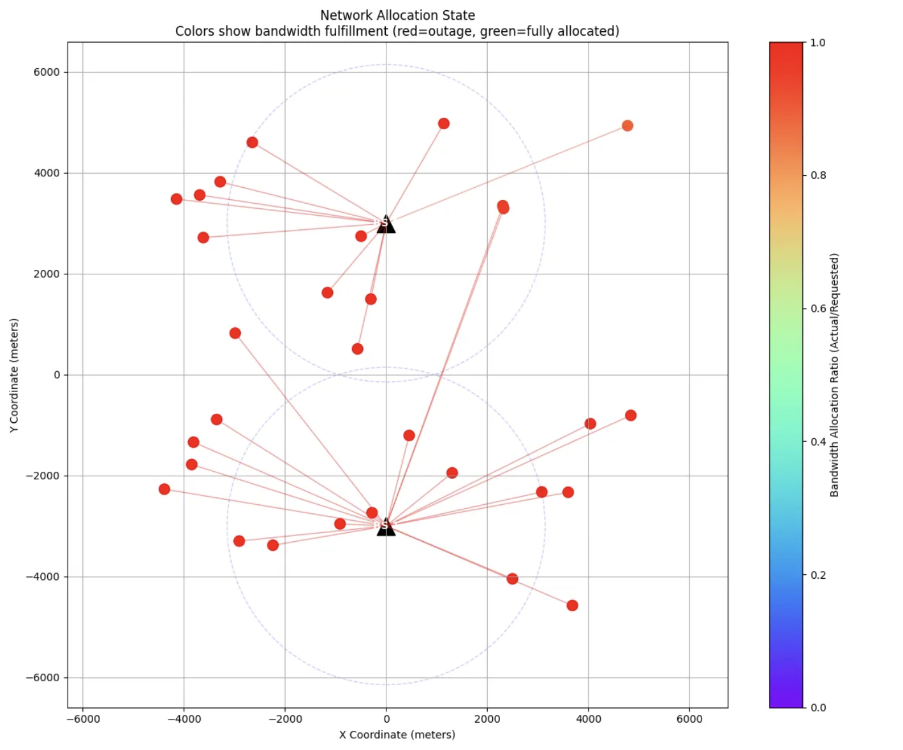
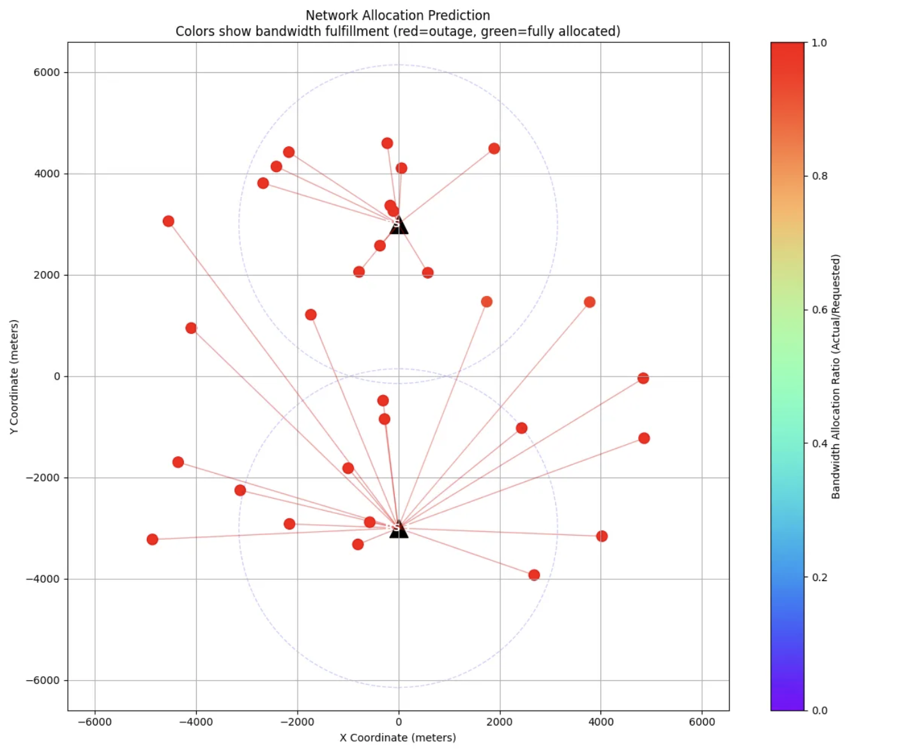
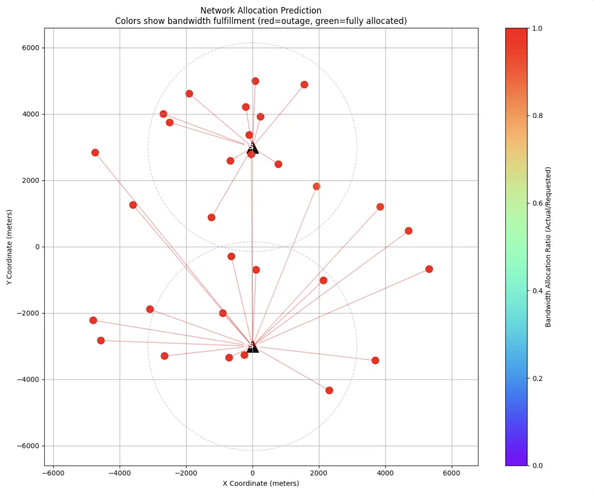

# Allocator Neural Network for Base Station and Bandwidth Allocation

## Project Overview

The **Allocator Neural Network (AllocatorNN)** is a deep learning model designed to efficiently allocate network resources in a wireless communication system. Specifically, the model aims to predict two key elements:

1. **Base Station (BS) Assignment**: Determines which BS should serve a given User Equipment (UE).
2. **Bandwidth Allocation**: Predicts the optimal bandwidth allocation for the UE based on its characteristics and the BS to which it is assigned.

The model takes several inputs, including:
- **UE State**: Features related to the state of the UE.
- **BS State**: Features related to the state of the BS.
- **Distance Matrix**: Distances between each UE and BS.
- **SNR (Signal-to-Noise Ratio)**: The quality of the communication channel between each UE and BS.

### Key Features
- **Encoder-Decoder Architecture**: The model uses separate encoders for UE and BS state features and a decoder to predict the outputs.
- **Attention Mechanism**: The model uses an attention mechanism to weigh the importance of different BSs for each UE, considering the SNR and distance between them.
- **Distance Penalty**: The model incorporates a distance penalty to avoid allocating UEs to BSs that are too far away.
- **Bandwidth Prediction**: The bandwidth allocation is predicted based on the UE’s state and the selected BS, with a constraint to ensure the allocation does not exceed the UE’s maximum requested bandwidth.

## Model Architecture

### 1. **Encoder Layers**:
   - Separate encoders process the input features of UEs and BSs.
   - Each encoder consists of a fully connected layer followed by ReLU activation and Layer Normalization.

### 2. **Attention Mechanism**:
   - The attention mechanism computes weights for each BS for each UE, considering their encoded features and the SNR.
   - The attention weights are computed through a softmax operation over the attention scores, which are influenced by the distance between the UE and BS.

### 3. **Base Station Selection**:
   - Based on the attention weights, the best BS is selected for each UE.

### 4. **Decoder**:
   - The selected BS features and the UE features are passed through a decoder to predict the bandwidth allocation and the BS assignment.

### 5. **Output Layers**:
   - **Base Station Assignment**: A classification layer predicts the BS assignment for each UE.
   - **Bandwidth Allocation**: A regression layer predicts the bandwidth allocation, ensuring it does not exceed the UE's requested bandwidth.

## Model Flow

1. **Input Data**: UE and BS features, distance matrix, and SNR values are fed into the model.
2. **Encoding**: The model encodes the UE and BS features using fully connected layers.
3. **Attention**: The attention mechanism computes the attention scores, factoring in both the SNR and distance penalty.
4. **Base Station Assignment**: The model selects the best BS for each UE based on the attention scores.
5. **Bandwidth Allocation**: The model predicts the bandwidth for each UE based on the selected BS and other features.
6. **Output**: The model outputs the predicted BS assignment and bandwidth allocation.

## Performance and Evaluation

The model is evaluated based on how well it predicts the optimal BS assignment and bandwidth allocation. Key metrics for evaluation include:
- **Accuracy of BS Assignment**: The percentage of UEs assigned to the correct BS.
- **Bandwidth Prediction Error**: The error between the predicted bandwidth and the actual bandwidth required by the UE.

## Dependencies

The following libraries are required to run the model:
- `torch`: For building and training the neural network.
- `torch.nn.functional`: For activation functions like ReLU and softmax.

## Code Structure

The project consists of the following key files:
- **AllocatorNN.py**: Contains the implementation of the neural network model.
- **train.py**: Script for training the model with the data.
- **data_loader.py**: Script for loading and preprocessing the input data.
- **utils.py**: Helper functions for model evaluation and utility.

## Visualizing the Model

The following figures represent key components of the model and its architecture:

*Figure 1: High-level overview of the AllocatorNN architecture.*

*Figure 2: Encoder layers for processing UE and BS state features.*

*Figure 3: Attention mechanism for computing BS selection weights.*

*Figure 4: Output layers for predicting BS assignment and bandwidth allocation.*

## Future Work

The model can be further improved by:
- Incorporating additional features, such as interference or traffic patterns.
- Exploring other types of attention mechanisms or more advanced encoder-decoder architectures.
- Performing real-time deployment for dynamic resource allocation in wireless networks.

## License

This project is licensed under the MIT License - see the [LICENSE](LICENSE) file for details.
